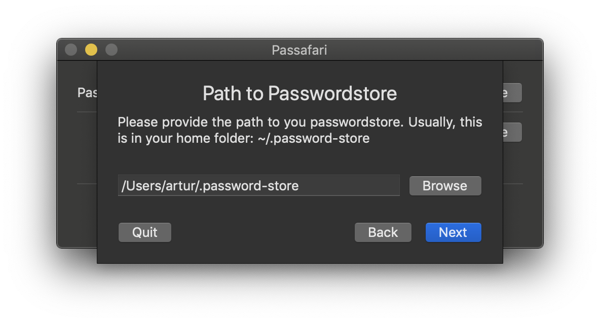
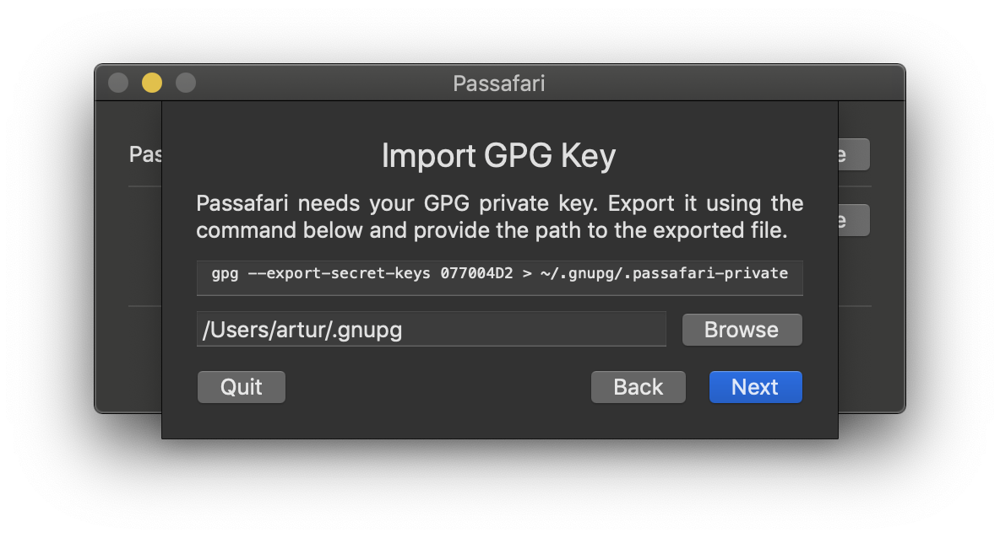
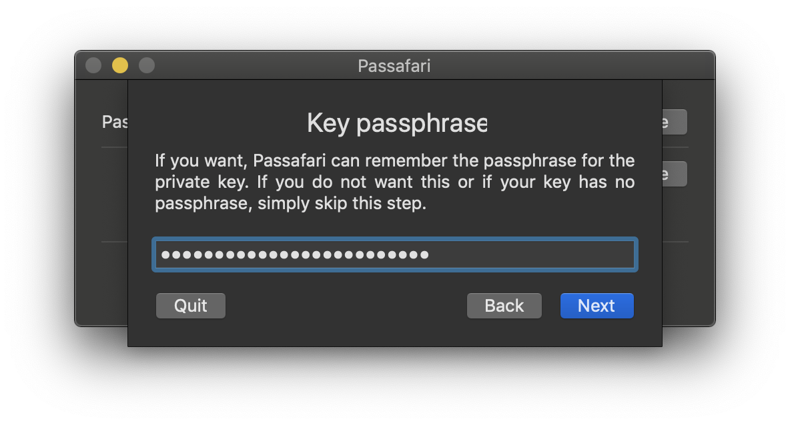

# Passafari

**Note: Passafari is currenlty a beta. Consider it broken expect errors and crashes.**

Passafari is a Safari extension for zx2c4's pass, a UNIX based password manager. It retrieves your decrypted passwords for the current domain and allows you to auto-fill login forms.
It uses Apples new [Safari App Extensions](https://developer.apple.com/documentation/safariservices/safari_app_extensions) API to communicate with a native sandboxed host app to do the security related stuff.

### Features
* Automatically searches passwords for the current domain.
* Search any password.
* Autofill passwords from the list of found passwords.
* Autofill passwords using a shortcut.

### Limitations
* The popover view can not be shown using the shortcut. Therefore, the first password for the current domain will be autofilled if multiple exist.
* OTP is not supported.
* Due to sandboxing restrictions, you have to export the private key and import into Passafari (you will be guided through these steps).
* Passafari was currently only tested using macOS Mojave and Safari 12, although it should work starting with macOS Sierra.

## Table of Contents
* [Requirements](#requirements)
* [Installation](#installation)
* [Usage](#usage)
* [Contributing](#contributing)

## Requirements
* macOS Sierra or later
* Pass (obviously)
* The first line of the password file has to be the password, the second line has to start with `login:`, `user:` or `username:`, followed by your username. All other lines after that are not considered. See the following example:

```
$ pass example.com
SuperSecurePassword
login: John Appleseed
```

## Installation
You have two options to use Passafari: build it yourself or use the releases. I plan to publish it using the Mac App Store and brew once it leaves the beta.

### Option 1: Use the Releases
Download the latest version of the app from the releases page and drop it in your applications folder (or where ever you want). Thats it.

If you want to update Passafari, replace the `Passafari.app` file with the newer version.

### Option 2: Build it yourself
You can  build Passafari yourself, which unfortunately is not as straight forward as it could be. Here are the required steps.

#### Cocoapods
We try to have as few dependencies as possible. But there still is one dependency, which can not be avoided. Therefore, you will beed Cocoapods. Use the [official guide](https://guides.cocoapods.org/using/getting-started.html) to install Cocoapods.

#### Checkout and prepare
Checkout this repo and install the dependencies using Cocoapods:

```
$ git clone git@github.com:adur1990/Passafari.git
$ cd passafari
$ pod install
```

Now, open the `passafari.xcworkspace` file (NOT `passafari.xcodeproj`), go to the General tab of the `passafari` target and use your own Team in the signing section.
Do the same for the `extension` target.

#### Building
Click on the build button (or use the `cmd-return` shortcut) and Passafari will be build. Congrats. You can use your self-built Passafari.

#### Updates
For updates, simply pull the version you want from the repo and build it again.

## Usage

### Running for the first time
Before running the extension for the first time, you have to setup the host app. Therefore, start `Passafari.app` and follow the on-screen instructions as follows (all settings can be changed afterwards):

<figure>
	<center>
		
		<figcaption>1: Path to Pass</figcaption>
	</center>
</figure>

Pass stores files by default in `~/.password-store`. Since Passafari is sandboxed for security reasons, you have to give permissions to Passafari to access these files. To do so, click on "Browse" and select the password store folder.

<figure>
	<center>
		
		<figcaption>2: Path to Private Key</figcaption>
	</center>
</figure>

After that, Passafari needs your private key. Again, since Passafari is sandboxed, you have to give permissions to access the private key. Further, Passafari is (currently?) not able to import the raw key from disk, but you have to export it first using the command displayed in the textfield. After that, again click on "Browse" and select the folder, where you exported the private key to. **Do not change the filename!**

<figure>
	<center>
		
		<figcaption>3: Passphrase for Private Key</figcaption>
	</center>
</figure>

Finally, you can provide the passphrase for your private key. If you do, the key will be stored securely in the macOS keychain. If you don't have a passphrase or do not want it to be stores, just leave this empy and finalize the setup. You will be asked for the passphrase every time you use the Safari extension.

That's it. You are ready to use Passafari. To do so, start Safari, go to Preferences and enable the extension.

### The host app
<figure>
	<center>
		
		<figcaption>4: Host Application</figcaption>
	</center>
</figure>

Since Passafari uses the host app to handle the security related password stuff, it has to run all the time. But you can safely close the window, just leave the app running.

Further, you can decide if an icon should be shown in the dock or the status bar or both or none.
And finally, you can change all settings from the first run setup.
In particular, you can change your passphrase or delete it from the macOS keychain by clearing the password field.

### The extension
The extension has two modes. You can click the toolbar item or use a shortcut.

#### Toolbar
<figure>
	<center>
		
		<figcaption>5: Using the Toolbar Item</figcaption>
	</center>
</figure>

When you click on the toolbar item, Passafari will use the current domain and search your passwordstore for a matching password. Double-clicking a found password or selecting it with arrow keys and return will autofill the login form. If the password was not correctly found, you can refine the search using the search field.

#### Shortcut
<figure>
	<center>
		
		<figcaption>6: Using the Shortcut</figcaption>
	</center>
</figure>

Passafari also offers a shortcut:

```
shift-alt-p
```

Unfortunately, Apple does not offer an option to invoke the toolbar popover when a shortcut is pressed. Therefore, Passafari will search a password containing the current domain as for the toolbar popover and autofill the first found password. If you have multiple logins for a domain, only the first one will be used using the shortcut.
You will see a little notification on the top right if a password is autofilled using the shortcut.

## Contributing
Any help is welcome, regardles if issue, pull request or comment. Feel free to open issues if something happens, create pull requests if you have any fixes, updates or new features or ping me via mail if you have questions. But please, be as precise as possible when creating issues. Give me as much information as possible, to make it possible for me to find, reproduce and fix your issues.