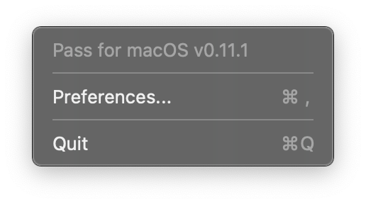
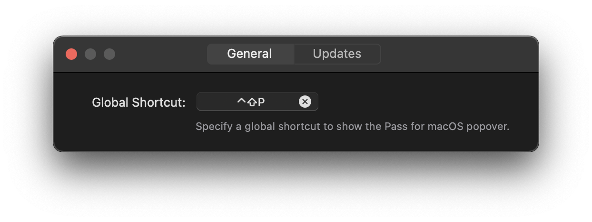
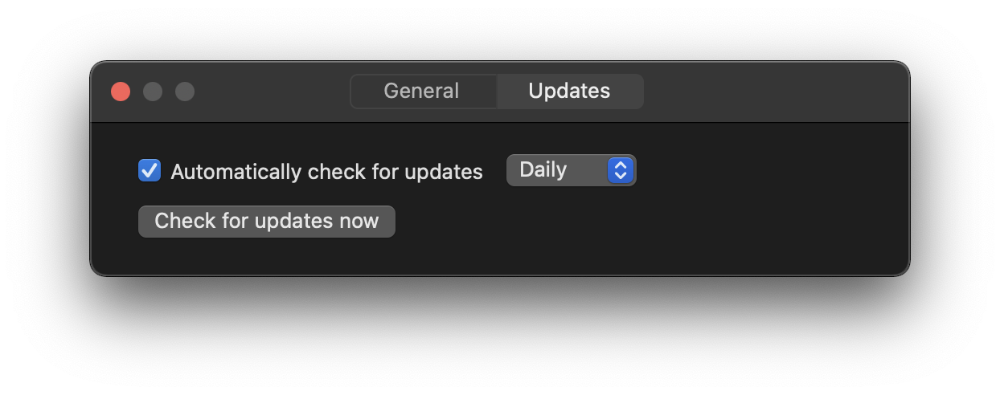

# Pass for macOS


> Pass for macOS is a macOS wrapper for zx2c4's `pass`, the standard UNIX password manager. It retrieves your decrypted passwords for the current domain and allows you to auto-fill login forms.

Pass for macOS consists of two parts.
First, a status bar app, which you can use to search passwords and copy them to the clipboard.
Second, a [Safari App Extensions](https://developer.apple.com/documentation/safariservices/safari_app_extensions) to auto-fill passwords in Safari using `pass`.

**Note: Pass for macOS is currenlty a beta. Consider it broken and expect errors and crashes.**

**Note: If you used Pass for macOS (formerly Passafari) versions 0.3.2 or earlier, you can safely delete the exported private key and your private key passphrase in the macOS keychain, if you stored it. Versions 0.4 or higher do not require this information anymore**

**Note: Pass for macOS does not come with its own pass installation, but assumes you have already `pass` installed somehow and it is in your `$PATH`.**

### Features
* Search any password from the macOS status bar.
* Copy any password to your clipboard for 45 seconds using the macOS status bar.
* Automatically search passwords for the current domain in Safari.
* Autofill passwords from the list of found passwords in Safari.

### Limitations
* OTP is not supported.
* Pass for macOS requires macOS Mojave 10.14.4, Catalina 10.15 and Big Sur 11 with Safari 12 and 13 and 14. If you use an older macOS Verison please see [Pass for macOS Legacy](https://github.com/adur1990/Pass-for-macOS-Legacy).

## Table of Contents
* [Requirements](#requirements)
* [Installation](#installation)
* [Usage](#usage)
* [Contributing](#contributing)

## Requirements
* macOS Mojave 10.14.4 or later
* `pass` and it's dependencies (i.e. `gpg`)
* A GUI-based pinentry. If the `gpg-agent` cache is empty, there is no way to enter a passphrase using a terminal based pinentry like `pinentry-tty` or `pinentry-curses`. `pinentry-mac` works great and can be installed using `brew install pinentry-mac`. After installing it, you have to enable it by adding the path to your GPG Agent config file with <code>bash -c "echo \\"pinentry-program &grave;which pinentry-mac&grave;\\" >> ~/.gnupg/gpg-agent.conf"</code>. Afterwards, reload you `gpg-agent` with `gpgconf --kill gpg-agent`.
* The first line of the password file has to be the password, the second line has to start with `login:`, `user:` or `username:`, followed by your username. All other lines after that are not considered. See the following example:

```
$ pass example.com
SuperSecurePassword
login: John Appleseed
```

### Dependencies
Pass for macOS relies on three dependencies:
* With [KeyboardShortcuts](https://github.com/sindresorhus/KeyboardShortcuts) by [Sindre Sorhus](https://github.com/sindresorhus) ([Their twitter profile](https://twitter.com/sindresorhus?lang=de)) it is possible to a) specify global shortcuts for apps and to b) let users record their own global shortcuts.
* [Preferences](https://github.com/sindresorhus/Preferences) by [Sindre Sorhus](https://github.com/sindresorhus) ([Their twitter profile](https://twitter.com/sindresorhus?lang=de)) lets developers create Preference windows easily.
* The [Sparkle Project](https://sparkle-project.org) gives developers all functionality to implement an update mechanism to their app.

## Installation
You have three options to use Pass for macOS: use the Github releases, homebrew or build it yourself.

### Option 1: Use the Releases
Download the latest version of the app from the releases page and drop it in your applications folder.
Thats it.

### Option 2: Use Homebrew
You can install Pass for macOS using homebrew.
Just run the following command:

```
brew install --cask adur1990/tap/passformacos
```

### Option 3: Build it yourself
You can  build Pass for macOS yourself.
Here are the required steps.

#### Checkout and prepare
First, checkout this repository:

```
$ git clone git@github.com:adur1990/Pass-for-macOS.git
```

Now, open the `passformacos.xcodeproj`, go to the General tab of `passformacos` target.
Here, check "Automatically manage signing" in the Signing section and select your own Team.
Do the same for the `extension` target.

Click on the build button and Pass for macOS will be build.
Congrats.
You can use your self-built Pass for macOS.

### Updating Pass for macOS
Starting with version 0.7, Pass for macOS uses the [Sparkle Project](https://sparkle-project.org) for automatic updates.
Therefore, you can use the preferences (accessed via right-clicking the status bar item), which allows you to either check for updates manually or enable automatic checks.

For updating from versions < 0.7 to >= 0.7, you need to uninstall Pass for macOS and disable the extension in Safari.
After the installation, everything should be fine.

## Usage
To the best of my knowledge, it is not possible to enable the hardened runtime for this app. Therefore, it is also not possible to get the [app notarized by Apple](https://developer.apple.com/documentation/xcode/notarizing_macos_software_before_distribution), which is [required](https://www.cdfinder.de/guide/blog/apple_hell.html) starting with macOS 10.14.5 (last Mojave release).
Therefore, you have to **right-click** or **ctrl-click** on `Pass for macOS.app` and select `open`. macOS will ask you, if you are really sure to open this "potentially malicous" app. If you confirm, you are free to use Pass for macOS.

After that, start Safari, go to Preferences and enable the extension.

### The host app
Since Pass for macOS uses the host app to handle the security related password stuff, it has to run all the time.
However, to give it some meaning, a status bar item is added.

#### Status Bar


By clicking on the status bar item or using the default shortcut `shift-ctrl-p`, a popup will be shown containing a search field.
Here, you can search for passwords.
Selecting a search result by double-click or with enter will copy the password to the clipboard, exactly as `pass -c <password>` does.

#### Settings


For settings, the status bar item has a context menu with can be accessed using right-click.
Here, you can check the currently installed version, quit the app or open the app's preferences window.



In the `General` tab you can record your own global shortcut for Pass for macOS.



The `Update` tab lets you decide whether you want to check automatically for updates and the corresponding check intervall.
Additionally, you can search manually for updates.

### The extension
The extension has two modes.
You can click the toolbar item or use the same shortcut as the host app uses.

#### Toolbar


When you click on the toolbar item, Pass for macOS will use the current domain and search your passwordstore for a matching password.
Double-clicking a found password or selecting it with arrow keys and return will autofill the login form.
If the password was not correctly found, you can refine the search using the search field.

#### Shortcut


But you can also use the shortcut from above.
Pass for macOS will search a password containing the current domain as for the toolbar popover.
If only one matching password was found, Pass for macOS will auto-fill the credentials and notify you with a little notification in the top right corner.
If more than one matching password was found, the popover in the toolbar will show and you can manually select the correct password or refine the search.

## Contributing
Any help is welcome, regardless if issue, pull request or comment.
Feel free to open issues if something happens, create pull requests if you have any fixes, updates or new features or ping me via mail if you have questions.
But please, be as precise as possible when creating issues.
Give me as much information as possible to make it possible for me to find, reproduce and fix your issues.
Finally, have a look into the [contribution guide](.github/CONTRIBUTING).

### Contributors
* Thank you, [jakajancar](https://github.com/jakajancar), for the [idea using a status bar host app](https://github.com/adur1990/Pass-for-macOS/issues/16) instead of a meaningless window app.
* Thank you, [rnkn](https://github.com/rnkn), for suggesting [renaming Passafari to Pass for macOS](https://github.com/adur1990/Pass-for-macOS/issues/20) and fixing the CONTRIBUTING markdown file.
