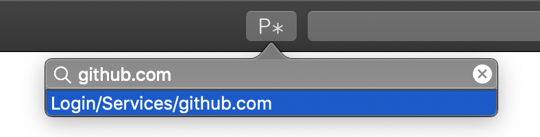

# Passafari

**Note: Passafari is currenlty a beta. Consider it broken, and expect errors and crashes.**

**Note: If you used Passafari versions 0.3.2 or earlier, you can safely delete the exported private key and your private key passphrase in the macOS keychain, if you stored it. Versions 0.4 or higher do not require this information anymore**

Passafari is a Safari extension for zx2c4's pass, the standard UNIX password manager. It retrieves your decrypted passwords for the current domain and allows you to auto-fill login forms.
It uses Apples new [Safari App Extensions](https://developer.apple.com/documentation/safariservices/safari_app_extensions) API to communicate securely with a native host app.

### Features
* Automatically searches passwords for the current domain.
* Autofill passwords from the list of found passwords.
* Autofill passwords using a shortcut.
* Search any password from the macOS status bar.
* Copy any password to your clipboard for 45 seconds using the macOS status bar.

### Limitations
* The popover view can not be shown using the shortcut. Therefore, the first password for the current domain will be autofilled if multiple exist.
* OTP is not supported.
* Passafari was currently only tested using macOS Mojave with Safari 12 and 13, although it should work starting with macOS Sierra.

## Table of Contents
* [Requirements](#requirements)
* [Installation](#installation)
* [Usage](#usage)
* [Contributing](#contributing)

## Requirements
* macOS Sierra or later
* Pass (obviously)
* The first line of the password file has to be the password, the second line has to start with `login:`, `user:` or `username:`, followed by your username. All other lines after that are not considered. See the following example:

```
$ pass example.com
SuperSecurePassword
login: John Appleseed
```

## Installation
You have three options to use Passafari: use the Github releases, homebrew or build it yourself.

### Option 1: Use the Releases
Download the latest version of the app from the releases page and drop it in your applications folder (or where ever you want). Thats it.

If you want to update Passafari, replace the `Passafari.app` file with the newer version.

### Option 2: Use Homebrew
You can install Passafari using homebrew. Just run the following command:

```
brew cask install adur1990/tap/passafari
```

If you want to update Passafari, run `brew upgrade`.

### Option 3: Build it yourself
You can  build Passafari yourself. Here are the required steps.

#### Checkout and prepare
First, checkout this repository:

```
$ git clone git@github.com:adur1990/Passafari.git
```

Now, open the `passafari.xcodeproj`, go to the General tab of `passafari` target.
Here, check "Automatically manage signing" in the Signing section and select your own Team.
Do the same for the `extension` target.

#### Building
Click on the build button (or use the `cmd-return` shortcut) and Passafari will be build. Congrats. You can use your self-built Passafari.

#### Updates
For updates, simply pull the version you want from the repo and build it again.

## Usage
To the best of my knowledge, it is not possible to enable the hardened runtime for this app. Therefore, it is also not possible to get the [app notarized by Apple](https://developer.apple.com/documentation/xcode/notarizing_macos_software_before_distribution), which is [required](https://www.cdfinder.de/guide/blog/apple_hell.html) starting with macOS 10.14.5 (last Mojave release).
Therefore, you have to **right-click** or **ctrl-click** on `Passafari.app` and select `open`. macOS will ask you, if you are really sure to open this "potentially malicous" app. If you confirm, you are free to use Passafari.

After that, start Safari, go to Preferences and enable the extension.

### The host app
<figure>
	<center>
		
		<figcaption>4: Host Application</figcaption>
	</center>
</figure>

Since Passafari uses the host app to handle the security related password stuff, it has to run all the time.

To give the host app some meaning instead of just "beeing there", you can either click on the status bar item or use the `shift-ctrl-p` shortcur to open a popover.
In this popover, you can search passwords and copy the to your clipboard for 45 seconds, exactly as `pass -c <password>` does.

### The extension
The extension has two modes. You can click the toolbar item or use a shortcut.

#### Toolbar
<figure>
	<center>
		
		<figcaption>5: Using the Toolbar Item</figcaption>
	</center>
</figure>

When you click on the toolbar item, Passafari will use the current domain and search your passwordstore for a matching password. Double-clicking a found password or selecting it with arrow keys and return will autofill the login form. If the password was not correctly found, you can refine the search using the search field.

#### Shortcut
<figure>
	<center>
		
		<figcaption>6: Using the Shortcut</figcaption>
	</center>
</figure>

Passafari also offers a shortcut:

```
shift-alt-p
```

Unfortunately, Apple does not offer an option to invoke the toolbar popover when a shortcut is pressed. Therefore, Passafari will search a password containing the current domain as for the toolbar popover and autofill the first found password. If you have multiple logins for a domain, only the first one will be used using the shortcut.
You will see a little notification on the top right if a password is autofilled using the shortcut.

## Contributing
Any help is welcome, regardles if issue, pull request or comment. Feel free to open issues if something happens, create pull requests if you have any fixes, updates or new features or ping me via mail if you have questions. But please, be as precise as possible when creating issues. Give me as much information as possible, to make it possible for me to find, reproduce and fix your issues.
Finally, have a look into the [contribution guide](.github/CONTRIBUTING).

### Contributors
* Thank you, [jakajancar](https://github.com/jakajancar), for the [idea using a status bar host app](https://github.com/adur1990/Passafari/issues/16) instead of a meaningless window app.
